If user exists then show USER_FOUND error message:

> if we dont do this, then api will show lots of information to normal user


---

update error message:


---

login route

invalid:

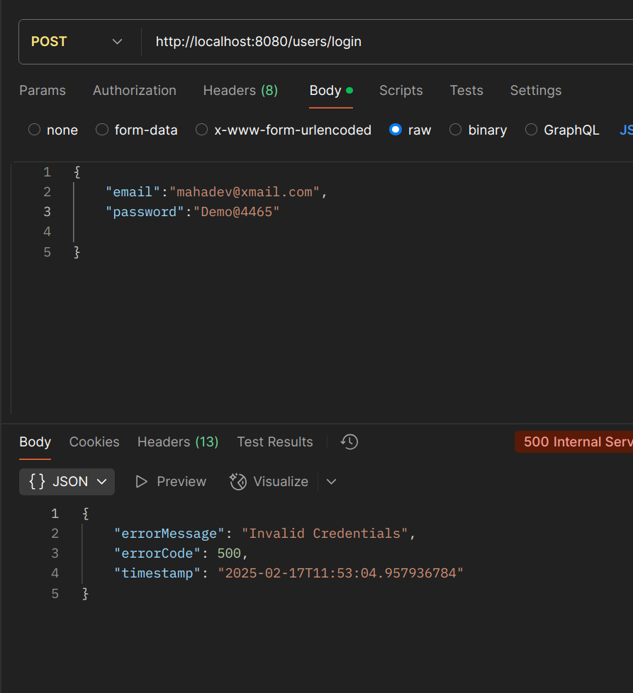

> add invalid user in postman/thunderclient, to see invalid email id error

success:

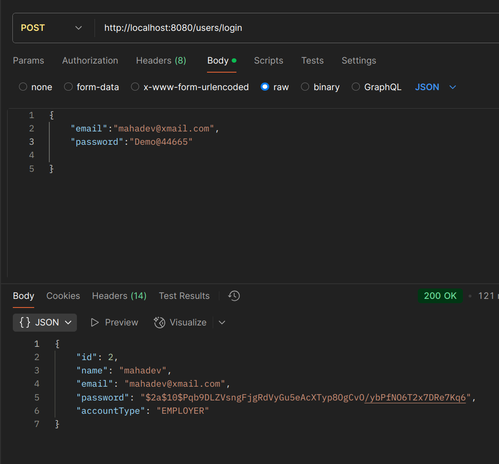

---

register user
- front end code check

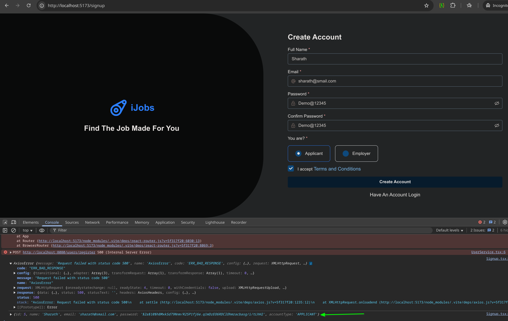

---
update Login with backend 

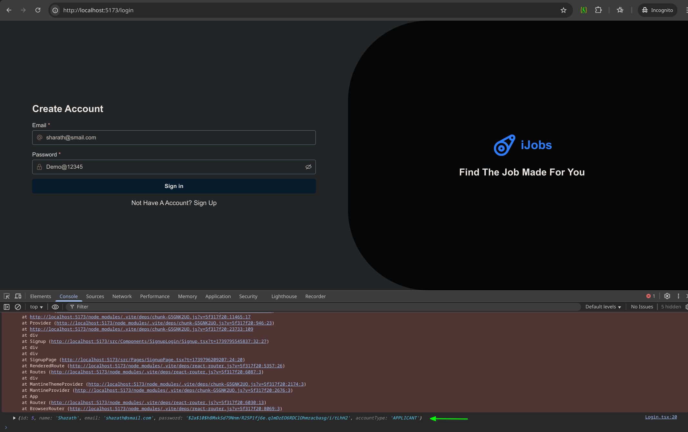

if you pass incorrect data you should get following errors:


---
send otp to user


success:

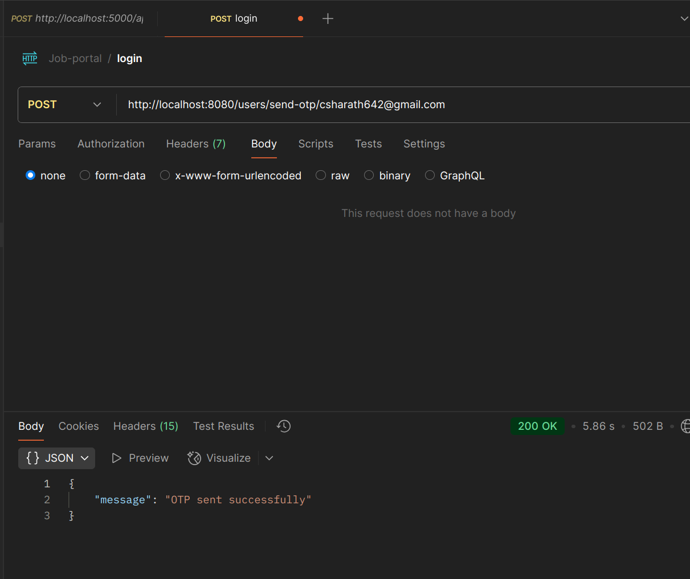

email success:


stylish otp:

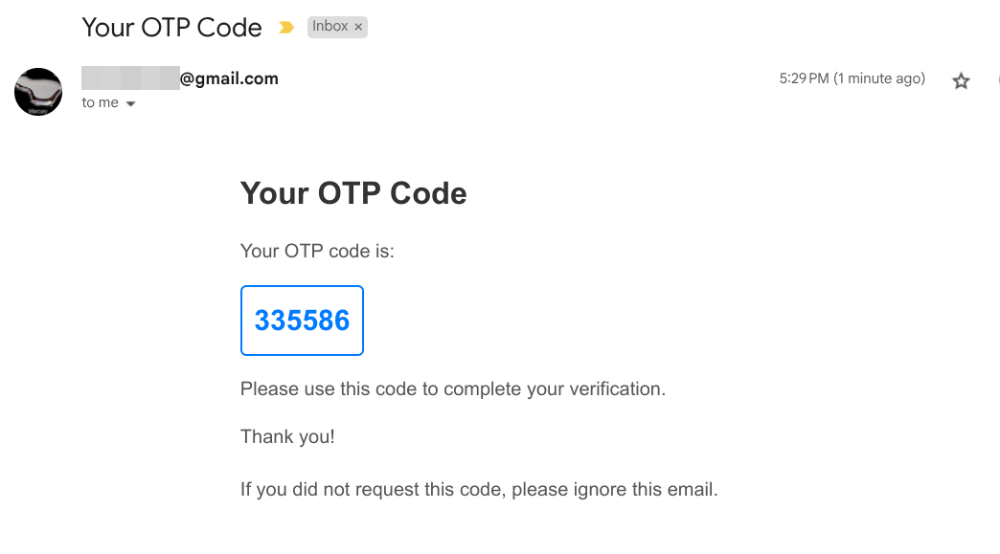

---
verifying otp:


invalid otp:

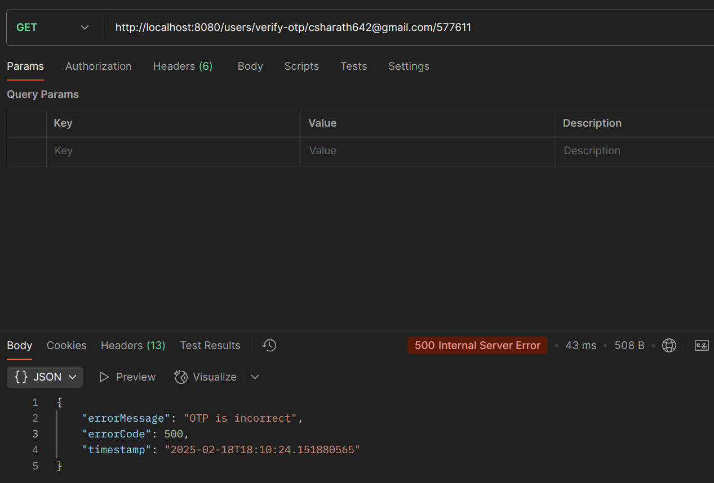

expired otp:
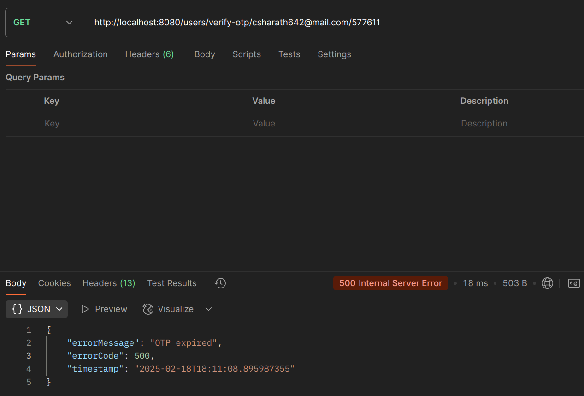

---
change password:

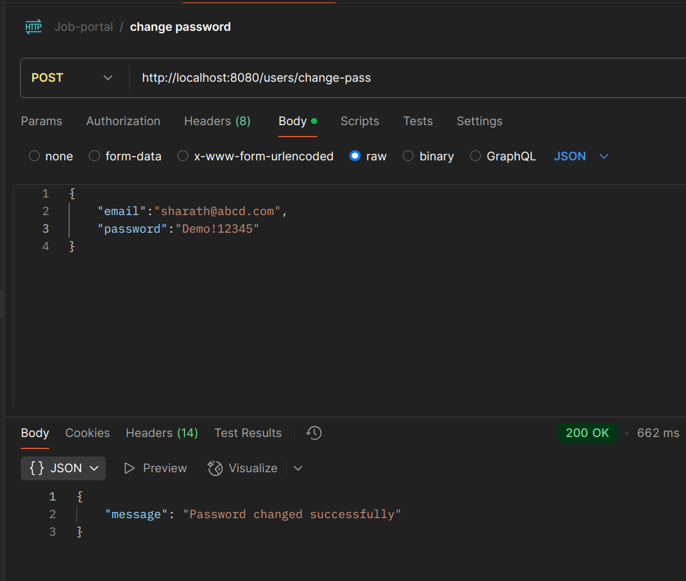

> you can check the same in databse, which should be effectively changed

in the ui:

forget password:

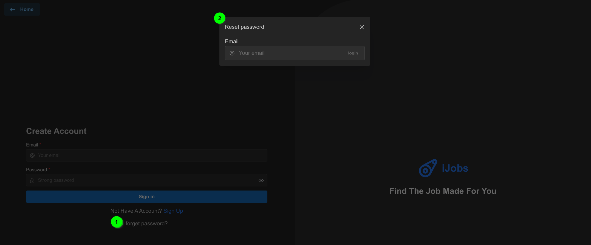

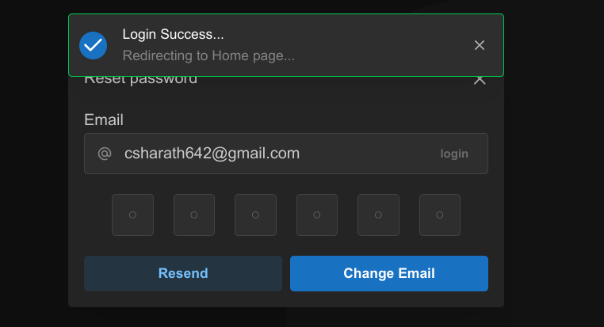

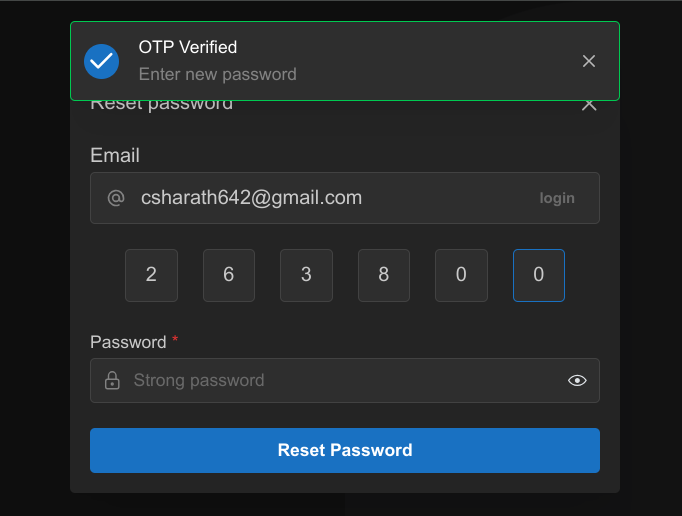

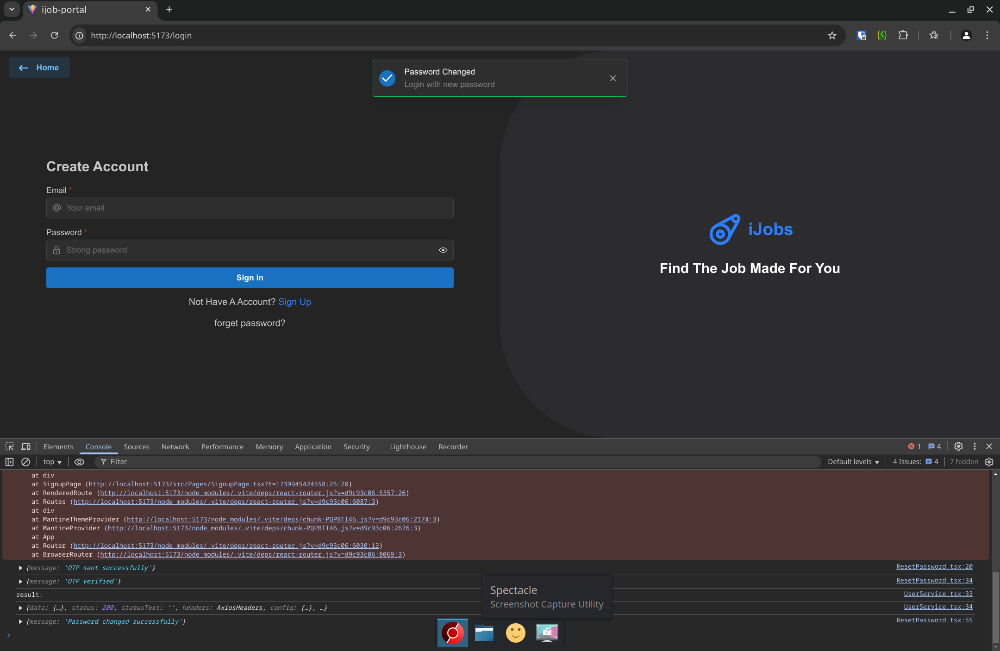 

---

using redux, storing user in Local storage:

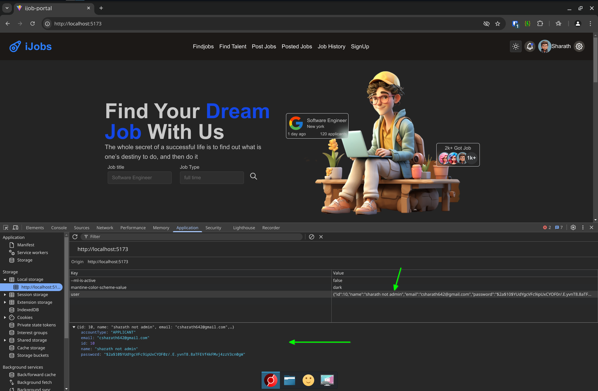

after loggin out we can remove it, code is in the ui: `Header/ProfileMenu.tsx`

---

Profile creation
1. delete all users from mongodb
2. in `sequence` collection **add row** with 

``` json
"_id":"profiles",
"seq":0
```
3. in `sequence` collection **update**

``` json
"_id":"users",
"seq":0
```
4. run the ui, and backend which will give below result

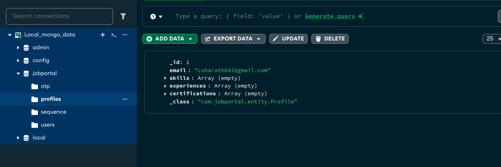


